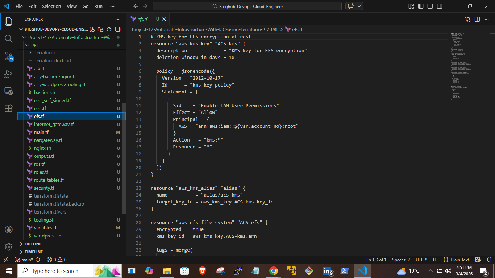

# Project 17 — Automate Infrastructure With IaC Using Terraform Part 2

## Table of Contents

1. [Introduction](#introduction)
2. [Architecture Overview](#architecture-overview)
3. [Prerequisites](#prerequisites)
4. [Project Structure](#project-structure)
5. [Step 1 — Add Private Subnets](#step-1--add-private-subnets)
6. [Step 2 — Create Internet Gateway](#step-2--create-internet-gateway)
7. [Step 3 — Create NAT Gateway](#step-3--create-nat-gateway)
8. [Step 4 — Create Route Tables](#step-4--create-route-tables)
9. [Step 5 — IAM Roles and Instance Profile](#step-5--iam-roles-and-instance-profile)
10. [Step 6 — Security Groups](#step-6--security-groups)
11. [Step 7 — ACM Certificate](#step-7--acm-certificate)
12. [Step 8 — Application Load Balancers](#step-8--application-load-balancers)
13. [Step 9 — Auto Scaling Groups](#step-9--auto-scaling-groups)
14. [Step 10 — Elastic File System](#step-10--elastic-file-system)
15. [Step 11 — RDS Instance](#step-11--rds-instance)
16. [Step 12 — Variables and Outputs](#step-12--variables-and-outputs)
17. [Step 13 — Plan, Apply, Verify, Destroy](#step-13--plan-apply-verify-destroy)
18. [Key Concepts](#key-concepts)
19. [Conclusion](#conclusion)

---

## Introduction

This project extends the VPC and subnet infrastructure built in Project 16 into a full, production-style AWS environment — entirely automated using Terraform. No manual console clicks. Every resource is declared as code, versioned, and reproducible.

By the end, Terraform provisions private subnets, routing, NAT, IAM, security groups, load balancers, auto scaling groups, shared file storage, and a managed database — all wired together across multiple availability zones.

---

## Architecture Overview

```
Internet
   │
   ▼
External ALB (public subnets)
   │
   ▼
Nginx Reverse Proxy ASG (public subnets)
   │
   ▼
Internal ALB (private subnets 0 & 1)
   │                   │
   ▼                   ▼
WordPress ASG     Tooling ASG
        │
        ▼
Data Layer (private subnets 2 & 3)
├── EFS (shared file storage)
└── RDS MySQL (multi-AZ)
```

Traffic flows from the internet through the external ALB to Nginx, which proxies internally to WordPress or Tooling based on host header. The data layer sits in the deepest private subnets, reachable only from webservers and the bastion host.

---

## Prerequisites

- Terraform >= 1.0 installed
- AWS CLI configured (`aws sts get-caller-identity` returns your account)
- tflint installed
- An AWS key pair created in `eu-central-1`
- An Amazon Linux 2 AMI ID for `eu-central-1`
- Project 16 completed

---

## Project Structure

```
PBL/
├── main.tf
├── variables.tf
├── terraform.tfvars
├── internet_gateway.tf
├── natgateway.tf
├── route_tables.tf
├── roles.tf
├── security.tf
├── cert.tf                  # commented-out placeholder (no domain required)
├── cert_self_signed.tf      # self-signed cert for ALB HTTPS
├── alb.tf
├── asg-bastion-nginx.tf
├── asg-wordpress-tooling.tf
├── efs.tf
├── rds.tf
├── outputs.tf
├── bastion.sh
├── nginx.sh
├── wordpress.sh
├── tooling.sh
└── .gitignore
```

---

## Step 1 — Add Private Subnets

`main.tf`

Four private subnets are added below the existing public subnets from Project 16, spread across two availability zones.

```hcl
resource "aws_subnet" "private" {
  count             = var.preferred_number_of_private_subnets == null ? length(data.aws_availability_zones.available.names) : var.preferred_number_of_private_subnets
  vpc_id            = aws_vpc.main.id
  cidr_block        = cidrsubnet(var.vpc_cidr, 4, count.index + 2)
  availability_zone = data.aws_availability_zones.available.names[count.index % 2]

  tags = merge(
    var.tags,
    {
      Name = format("PrivateSubnet-%s", count.index)
    },
  )
}
```


**Code — Explanation**
- `count.index + 2` → public subnets already used CIDR indexes 0 and 1; private subnets start at 2 to avoid overlap.
- `count.index % 2` → cycles through 2 AZs (0, 1, 0, 1) so 4 subnets spread evenly for high availability.
- `cidrsubnet()` → automatically generates unique, non-overlapping CIDR blocks from the VPC range.
- `format("PrivateSubnet-%s", count.index)` → gives each subnet a clean unique name: PrivateSubnet-0, PrivateSubnet-1, etc.
- `merge(var.tags, {...})` → applies global tags plus the subnet-specific Name tag in one call.

---

## Step 2 — Create Internet Gateway

`internet_gateway.tf`

```hcl
resource "aws_internet_gateway" "ig" {
  vpc_id = aws_vpc.main.id

  tags = merge(
    var.tags,
    {
      Name = format("%s-%s!", aws_vpc.main.id, "IG")
    },
  )
}
```


**Code — Explanation**
- Attaches an Internet Gateway to the VPC so public subnets can send and receive traffic from the internet.
- `format("%s-%s!", aws_vpc.main.id, "IG")` → generates a dynamic name using the actual VPC ID at runtime, e.g. `vpc-0abc1234-IG!`.

---

## Step 3 — Create NAT Gateway

`natgateway.tf`

The NAT Gateway allows private instances to initiate outbound internet connections without being reachable from the internet. It sits in a public subnet and uses an Elastic IP.

**Elastic IP**

```hcl
resource "aws_eip" "nat_eip" {
  domain     = "vpc"
  depends_on = [aws_internet_gateway.ig]

  tags = merge(
    var.tags,
    {
      Name = format("%s-EIP", var.name)
    },
  )
}
```

**Code — Explanation**
- `domain = "vpc"` → allocates the EIP for use within a VPC (replaces the deprecated `vpc = true`).
- `depends_on` → explicitly tells Terraform the Internet Gateway must exist before the EIP is created.

**NAT Gateway**

```hcl
resource "aws_nat_gateway" "nat" {
  allocation_id = aws_eip.nat_eip.id
  subnet_id     = element(aws_subnet.public[*].id, 0)
  depends_on    = [aws_internet_gateway.ig]

  tags = merge(
    var.tags,
    {
      Name = format("%s-Nat", var.name)
    },
  )
}
```


**Code — Explanation**
- `allocation_id` → binds the NAT Gateway to the Elastic IP.
- `subnet_id` → places the NAT Gateway in the first public subnet (must be public to reach the internet).
- `depends_on` → ensures the Internet Gateway is ready before this is created.

---

## Step 4 — Create Route Tables

`route_tables.tf`

Two route tables are created: one for public subnets routing to the Internet Gateway, and one for private subnets routing to the NAT Gateway.

**Private Route Table**

```hcl
resource "aws_route_table" "private-rtb" {
  vpc_id = aws_vpc.main.id

  tags = merge(
    var.tags,
    {
      Name = format("%s-Private-Route-Table", var.name)
    },
  )
}

resource "aws_route" "private-rtb-route" {
  route_table_id         = aws_route_table.private-rtb.id
  destination_cidr_block = "0.0.0.0/0"
  nat_gateway_id         = aws_nat_gateway.nat.id
}

resource "aws_route_table_association" "private-subnets-assoc" {
  count          = length(aws_subnet.private[*].id)
  subnet_id      = element(aws_subnet.private[*].id, count.index)
  route_table_id = aws_route_table.private-rtb.id
}
```

**Public Route Table**

```hcl
resource "aws_route_table" "public-rtb" {
  vpc_id = aws_vpc.main.id

  tags = merge(
    var.tags,
    {
      Name = format("%s-Public-Route-Table", var.name)
    },
  )
}

resource "aws_route" "public-rtb-route" {
  route_table_id         = aws_route_table.public-rtb.id
  destination_cidr_block = "0.0.0.0/0"
  gateway_id             = aws_internet_gateway.ig.id
}

resource "aws_route_table_association" "public-subnets-assoc" {
  count          = length(aws_subnet.public[*].id)
  subnet_id      = element(aws_subnet.public[*].id, count.index)
  route_table_id = aws_route_table.public-rtb.id
}
```


**Code — Explanation**
- Public subnets route `0.0.0.0/0` to the Internet Gateway — direct, bidirectional internet access.
- Private subnets route `0.0.0.0/0` to the NAT Gateway — outbound only, no inbound from the internet.
- `aws_route_table_association` with `count` links every subnet to its respective table in one block.

---

## Step 5 — IAM Roles and Instance Profile

`roles.tf`

EC2 instances need an IAM Role to interact with AWS services. The role is created, a policy is attached, and an Instance Profile wraps it for EC2 use.

```hcl
resource "aws_iam_role" "ec2_instance_role" {
  name = "ec2_instance_role"

  assume_role_policy = jsonencode({
    Version = "2012-10-17"
    Statement = [{
      Action    = "sts:AssumeRole"
      Effect    = "Allow"
      Principal = { Service = "ec2.amazonaws.com" }
    }]
  })

  tags = merge(var.tags, { Name = "aws assume role" })
}

resource "aws_iam_policy" "policy" {
  name   = "ec2_instance_policy"
  policy = jsonencode({
    Version = "2012-10-17"
    Statement = [{
      Action   = ["ec2:Describe*"]
      Effect   = "Allow"
      Resource = "*"
    }]
  })

  tags = merge(var.tags, { Name = "aws assume policy" })
}

resource "aws_iam_role_policy_attachment" "test-attach" {
  role       = aws_iam_role.ec2_instance_role.name
  policy_arn = aws_iam_policy.policy.arn
}

resource "aws_iam_instance_profile" "ip" {
  name = "aws_instance_profile_test"
  role = aws_iam_role.ec2_instance_role.name
}
```


**Code — Explanation**
- **Trust Policy (AssumeRole)** → answers *who can use this role*. Here `ec2.amazonaws.com` is trusted to assume it.
- **Permission Policy** → answers *what the role can do*. Here: describe EC2 resources.
- **Instance Profile** → the wrapper EC2 requires to use an IAM Role. Roles cannot be attached to EC2 directly.
- `aws_iam_role_policy_attachment` → links the permission policy to the role.

---

## Step 6 — Security Groups

`security.tf`

One security group per architecture layer. Groups with source-based rules use `aws_security_group_rule` to reference another security group rather than a CIDR block.

```hcl
# External ALB — HTTP and HTTPS from anywhere
resource "aws_security_group" "ext-alb-sg" { ... }

# Bastion — SSH from anywhere
resource "aws_security_group" "bastion_sg" { ... }

# Nginx — HTTPS from ext-alb-sg, SSH from bastion_sg
resource "aws_security_group" "nginx-sg" { ... }
resource "aws_security_group_rule" "inbound-nginx-http" {
  source_security_group_id = aws_security_group.ext-alb-sg.id
  security_group_id        = aws_security_group.nginx-sg.id
  ...
}

# Internal ALB — HTTPS from nginx-sg only
resource "aws_security_group" "int-alb-sg" { ... }

# Webservers — HTTPS from int-alb-sg, SSH from bastion_sg
resource "aws_security_group" "webserver-sg" { ... }

# Datalayer — NFS (2049) from webservers, MySQL (3306) from bastion and webservers
resource "aws_security_group" "datalayer-sg" { ... }
```


**Code — Explanation**
- `source_security_group_id` → allows traffic from any resource in the referenced security group instead of a hardcoded IP range.
- Each layer only accepts traffic from the layer directly before it — defence in depth.
- `aws_security_group_rule` is used separately (not inline) when the source is another security group, to avoid circular dependency errors.

**Traffic flow:**
```
Internet → ext-alb-sg → nginx-sg → int-alb-sg → webserver-sg → datalayer-sg
                         bastion-sg ─────────────────────────────────────────↗
```

---

## Step 7 — ACM Certificate

`cert.tf` | `cert_self_signed.tf`

No domain is available for this project. `cert.tf` holds the full ACM + Route 53 configuration as a commented-out placeholder. A self-signed certificate is generated so the ALB HTTPS listeners work.

```hcl
resource "tls_private_key" "self_signed" {
  algorithm = "RSA"
  rsa_bits  = 2048
}

resource "tls_self_signed_cert" "self_signed" {
  private_key_pem = tls_private_key.self_signed.private_key_pem

  subject {
    common_name  = "example.com"
    organization = "ACS Dev"
  }

  validity_period_hours = 8760

  allowed_uses = ["key_encipherment", "digital_signature", "server_auth"]
}

resource "aws_acm_certificate" "self_signed" {
  private_key      = tls_private_key.self_signed.private_key_pem
  certificate_body = tls_self_signed_cert.self_signed.cert_pem
}
```


**Code — Explanation**
- `tls_private_key` → generates an RSA key pair managed in Terraform state.
- `tls_self_signed_cert` → creates a certificate signed by the same key (no CA involved).
- `aws_acm_certificate` → imports the cert into ACM so ALB listeners can reference it via `aws_acm_certificate.self_signed.arn`.

---

## Step 8 — Application Load Balancers

`alb.tf`

Two ALBs are created: one external (internet-facing) routing to Nginx, and one internal routing to WordPress or Tooling based on host header.

**External ALB**

```hcl
resource "aws_lb" "ext-alb" {
  name               = "ext-alb"
  internal           = false
  security_groups    = [aws_security_group.ext-alb-sg.id]
  subnets            = [aws_subnet.public[0].id, aws_subnet.public[1].id]
  load_balancer_type = "application"
  ip_address_type    = "ipv4"

  tags = merge(var.tags, { Name = "ACS-ext-alb" })
}

resource "aws_lb_target_group" "nginx-tgt" {
  name        = "nginx-tgt"
  port        = 443
  protocol    = "HTTPS"
  target_type = "instance"
  vpc_id      = aws_vpc.main.id

  health_check {
    path                = "/healthstatus"
    protocol            = "HTTPS"
    interval            = 10
    timeout             = 5
    healthy_threshold   = 5
    unhealthy_threshold = 2
  }
}

resource "aws_lb_listener" "nginx-listner" {
  load_balancer_arn = aws_lb.ext-alb.arn
  port              = 443
  protocol          = "HTTPS"
  certificate_arn   = aws_acm_certificate.self_signed.arn

  default_action {
    type             = "forward"
    target_group_arn = aws_lb_target_group.nginx-tgt.arn
  }
}
```

**Internal ALB**

```hcl
resource "aws_lb" "ialb" {
  name            = "ialb"
  internal        = true
  security_groups = [aws_security_group.int-alb-sg.id]
  subnets         = [aws_subnet.private[0].id, aws_subnet.private[1].id]
  ...
}

# Default listener action → WordPress
# Listener rule → Tooling when host header matches tooling.example.com
```


**Code — Explanation**
- `internal = false` → external ALB gets a public DNS name; `internal = true` → internal ALB is VPC-only.
- Target groups define where the ALB sends traffic and how it health-checks instances.
- The internal ALB listener rule uses `host_header` to route tooling traffic separately from WordPress.

---

## Step 9 — Auto Scaling Groups

`asg-bastion-nginx.tf` | `asg-wordpress-tooling.tf`

Four Auto Scaling Groups are created: Bastion and Nginx in public subnets, WordPress and Tooling in private subnets. Each has a Launch Template defining the instance configuration.

```hcl
resource "aws_launch_template" "bastion-launch-template" {
  image_id               = var.ami
  instance_type          = "t2.micro"
  vpc_security_group_ids = [aws_security_group.bastion_sg.id]
  key_name               = var.keypair

  iam_instance_profile {
    name = aws_iam_instance_profile.ip.id
  }

  user_data = filebase64("${path.module}/bastion.sh")

  lifecycle {
    create_before_destroy = true
  }

  tag_specifications {
    resource_type = "instance"
    tags          = merge(var.tags, { Name = "bastion-launch-template" })
  }
}

resource "aws_autoscaling_group" "bastion-asg" {
  name                      = "bastion-asg"
  min_size                  = 1
  max_size                  = 2
  desired_capacity          = 1
  health_check_grace_period = 300
  health_check_type         = "ELB"

  vpc_zone_identifier = [aws_subnet.public[0].id, aws_subnet.public[1].id]

  launch_template {
    id      = aws_launch_template.bastion-launch-template.id
    version = "$Latest"
  }
}
```

SNS notifications are configured to alert on launch, terminate, and error events across all four ASGs.


**Code — Explanation**
- `launch_template` → defines the AMI, instance type, security group, key pair, and startup script for instances the ASG creates.
- `user_data = filebase64(...)` → encodes the shell script and passes it to the instance on first boot.
- `create_before_destroy` → Terraform creates the replacement before destroying the old one during updates, avoiding downtime.
- `lb_target_group_arn` in `aws_autoscaling_attachment` → registers ASG instances with the ALB target group automatically.
- `min_size / max_size / desired_capacity` → defines scaling boundaries. The ASG always maintains at least 1 instance.

---

## Step 10 — Elastic File System

`efs.tf`

WordPress and Tooling need shared storage so all instances in their ASGs read and write the same files. EFS is a managed NFS share that multiple EC2 instances can mount simultaneously.

```hcl
resource "aws_kms_key" "ACS-kms" {
  description             = "KMS key for EFS encryption"
  deletion_window_in_days = 10

  policy = jsonencode({
    Version = "2012-10-17"
    Statement = [{
      Sid       = "Enable IAM User Permissions"
      Effect    = "Allow"
      Principal = { AWS = "arn:aws:iam::${var.account_no}:root" }
      Action    = "kms:*"
      Resource  = "*"
    }]
  })
}

resource "aws_efs_file_system" "ACS-efs" {
  encrypted  = true
  kms_key_id = aws_kms_key.ACS-kms.arn

  tags = merge(var.tags, { Name = "ACS-efs" })
}

resource "aws_efs_mount_target" "subnet-1" {
  file_system_id  = aws_efs_file_system.ACS-efs.id
  subnet_id       = aws_subnet.private[2].id
  security_groups = [aws_security_group.datalayer-sg.id]
}

resource "aws_efs_access_point" "wordpress" {
  file_system_id = aws_efs_file_system.ACS-efs.id

  posix_user { gid = 0; uid = 0 }

  root_directory {
    path = "/wordpress"
    creation_info { owner_gid = 0; owner_uid = 0; permissions = 0755 }
  }
}
```



**Code — Explanation**
- `aws_kms_key` → creates a customer-managed encryption key. All data on EFS is encrypted at rest.
- `encrypted = true` + `kms_key_id` → links the EFS volume to the KMS key.
- Mount targets are placed in private subnets 2 and 3 (the data layer), one per AZ for redundancy.
- Access points for WordPress and Tooling create isolated directories (`/wordpress`, `/tooling`) — each app mounts only its own path.

---

## Step 11 — RDS Instance

`rds.tf`

```hcl
resource "aws_db_subnet_group" "ACS-rds" {
  name       = "acs-rds"
  subnet_ids = [aws_subnet.private[2].id, aws_subnet.private[3].id]

  tags = merge(var.tags, { Name = "ACS-rds" })
}

resource "aws_db_instance" "ACS-rds" {
  allocated_storage      = 20
  storage_type           = "gp2"
  engine                 = "mysql"
  engine_version         = "8.0"
  instance_class         = "db.t3.micro"
  db_name                = "acsdb"
  username               = var.master-username
  password               = var.master-password
  parameter_group_name   = "default.mysql8.0"
  db_subnet_group_name   = aws_db_subnet_group.ACS-rds.name
  skip_final_snapshot    = true
  vpc_security_group_ids = [aws_security_group.datalayer-sg.id]
  multi_az               = true
}
```


**Code — Explanation**
- `aws_db_subnet_group` → tells RDS which subnets it can use. Private subnets 2 and 3 keep the database in the data layer, unreachable from the internet.
- `multi_az = true` → AWS provisions a standby replica in a second AZ and fails over automatically if the primary has issues.
- `skip_final_snapshot = true` → allows `terraform destroy` to delete the instance without requiring a final backup snapshot.
- `sensitive = true` on the password variable → Terraform never prints it in plan or apply output.

---

## Step 12 — Variables and Outputs

`variables.tf` declares all input variables. `terraform.tfvars` provides the actual values and is excluded from version control via `.gitignore`.

Key variables added in this project:

| Variable | Type | Purpose |
|---|---|---|
| `preferred_number_of_private_subnets` | number | How many private subnets to create |
| `ami` | string | AMI ID for launch templates |
| `keypair` | string | EC2 key pair name |
| `account_no` | string | AWS account number for KMS policy |
| `master-username` | string | RDS admin username |
| `master-password` | string (sensitive) | RDS admin password |
| `tags` | map(string) | Default tags applied to all resources |

`outputs.tf` prints useful values after apply:

```hcl
output "alb_dns_name" {
  value = aws_lb.ext-alb.dns_name
}

output "nat_gateway_ip" {
  value = aws_eip.nat_eip.public_ip
}
```

---

## Step 13 — Plan, Apply, Verify, Destroy

**Validate and plan:**

```bash
terraform fmt
terraform validate
tflint --init && tflint
terraform plan
```

The plan should show approximately 60+ resources to create. Take a screenshot of the summary line before applying.

**Apply:**

```bash
terraform apply
```

Type `yes` when prompted. Apply takes 10–20 minutes — RDS and NAT Gateway are the slowest.

**Verify in the AWS Console (`eu-central-1`):**

| Service | What to check |
|---|---|
| VPC | CIDR `172.16.0.0/16` present |
| Subnets | 2 public + 4 private = 6 total |
| Internet Gateway | Attached to VPC |
| NAT Gateway | Status: Available |
| Load Balancers | `ext-alb` and `ialb` |
| Target Groups | `nginx-tgt`, `wordpress-tgt`, `tooling-tgt` |
| Auto Scaling Groups | All 4 present |
| EFS | File system visible |
| RDS | Instance visible |


**Destroy immediately after verification:**

```bash
terraform destroy
```

NAT Gateways and RDS are not free-tier. Leaving them running accumulates charges quickly.

---

## Key Concepts

**AssumeRole Policy vs Role Policy**

The trust policy (AssumeRole) answers *who can use this role* — here `ec2.amazonaws.com` is trusted to assume it. The permission policy answers *what the role can do* — here `ec2:Describe*`. Both must exist: one without the other means either nobody can assume the role, or whoever does gets no permissions.

**OSI Model and TCP/IP**

The OSI model has 7 layers from Physical to Application. The TCP/IP suite maps these into 4: Network Access, Internet, Transport, Application. In this project's architecture, the ALBs operate at Layer 7, routing decisions use IP (Layer 3), and application communication uses TCP (Layer 4) on ports 443, 3306, and 2049.

**Networking Concepts**

CIDR notation (`172.16.0.0/16`) defines a range of IP addresses — the `/16` means 65,536 possible addresses. `cidrsubnet()` carves these into smaller blocks per subnet. Public subnets route outbound traffic through the Internet Gateway; private subnets route through the NAT Gateway, enabling outbound-only internet access without exposing instances to inbound connections.

---

## Conclusion

This project moves from manually creating individual resources to defining an entire multi-tier AWS architecture as reusable, version-controlled infrastructure code. Every component — networking, compute, security, storage, and database — is wired together through Terraform references rather than hardcoded values, making the setup reproducible across environments.

The next step (Project 18) refactors this flat file structure into Terraform Modules, eliminating repetition and making the codebase maintainable at scale.

---

*Tools used: Terraform · AWS · tflint · Git*
