# Implementing HTTPS with cert-manager and Let's Encrypt

This project adds HTTPS to the Artifactory deployment from Project 25, using cert-manager and Let's Encrypt to issue and renew a trusted TLS certificate automatically. I built the setup manually first, then automated the whole thing with Terraform, importing every manually created resource into state rather than starting over.

## Table of contents

- [Project objectives](#project-objectives)
- [Environment](#environment)
- [Architecture](#architecture)
- [Prerequisites](#prerequisites)
- [Manual setup](#manual-setup)
  - [Creating the IAM OIDC role for cert-manager](#creating-the-iam-oidc-role-for-cert-manager)
  - [Installing cert-manager](#installing-cert-manager)
  - [Configuring the ClusterIssuer](#configuring-the-clusterissuer)
  - [Updating the Artifactory ingress](#updating-the-artifactory-ingress)
  - [Verifying certificate issuance](#verifying-certificate-issuance)
- [Problems encountered and how I fixed them](#problems-encountered-and-how-i-fixed-them)
- [Automating with Terraform](#automating-with-terraform)
  - [Reading Project 24's state remotely](#reading-project-24s-state-remotely)
  - [The IAM role, using a community IRSA module](#the-iam-role-using-a-community-irsa-module)
  - [Installing cert-manager and RBAC through Terraform](#installing-cert-manager-and-rbac-through-terraform)
  - [The ClusterIssuer, and why it needs a different provider](#the-clusterissuer-and-why-it-needs-a-different-provider)
  - [Importing the resources I already built by hand](#importing-the-resources-i-already-built-by-hand)
- [Cleanup](#cleanup)
- [What I learned](#what-i-learned)

## Project objectives

The objectives were to:

Issue a trusted certificate for tooling.artifactory.lydiahnganga.cloud using Let's Encrypt.
Authenticate cert-manager to Route 53 using IRSA, not long lived AWS credentials.
Solve the ACME challenge using DNS01, scoped to the one hosted zone.
Terminate TLS at the Nginx ingress controller.
Automate the entire setup with Terraform, reading cluster details from Project 24's state instead of hardcoding them.
Bring every manually created resource under Terraform's management through import, rather than duplicating or discarding it.

## Environment

| Component | Configuration |
|---|---|
| Cluster | lydiah-eks-cluster, us-west-1, from Project 24 |
| Domain | tooling.artifactory.lydiahnganga.cloud |
| Hosted zone | lydiahnganga.cloud, Route 53 |
| cert-manager version | v1.15.3 |
| ACME server | Let's Encrypt production, acme-v02.api.letsencrypt.org |
| Challenge type | DNS01, using the Route 53 solver |
| Terraform providers | aws, kubernetes, helm, and gavinbunney/kubectl |

## Architecture

Certificate issuance follows this route:

```
cert-manager pod (ServiceAccount with IRSA annotation)
  -> assumes cert-manager-role via OIDC
  -> creates a TXT record in Route 53 for the ACME challenge
  -> Let's Encrypt validates the TXT record
  -> Let's Encrypt issues the certificate
  -> cert-manager stores it in a Kubernetes secret
  -> the Nginx ingress serves it for tooling.artifactory.lydiahnganga.cloud
```

The IRSA (IAM roles for service accounts) role is scoped narrowly. It can only manage records in the one hosted zone, and it can only be assumed by the cert-manager service account in the cert-manager namespace, using conditions tied to this specific cluster's OIDC provider.

## Prerequisites

An EKS cluster with an IAM OIDC provider associated, from Project 24.
The Nginx ingress controller and Artifactory already deployed, from Project 25.
A Route 53 hosted zone for the domain.
Helm, kubectl, and the AWS CLI configured against the cluster.

## Manual setup

### Creating the IAM OIDC role for cert-manager

The cluster already had an OIDC provider from Project 24:

```bash
aws eks describe-cluster --name lydiah-eks-cluster --region us-west-1 \
  --query "cluster.identity.oidc.issuer" --output text
```

I scoped the IAM policy to the one hosted zone rather than granting access to all zones in the account:

```json
{
  "Version": "2012-10-17",
  "Statement": [
    {
      "Effect": "Allow",
      "Action": "route53:GetChange",
      "Resource": "arn:aws:route53:::change/*"
    },
    {
      "Effect": "Allow",
      "Action": [
        "route53:ChangeResourceRecordSets",
        "route53:ListResourceRecordSets"
      ],
      "Resource": "arn:aws:route53:::hostedzone/Z03719021HL33F6N2SEA4"
    },
    {
      "Effect": "Allow",
      "Action": "route53:ListHostedZonesByName",
      "Resource": "*"
    }
  ]
}
```

The trust policy restricts who can assume the role to the exact service account, using the sub and aud conditions:

```json
{
  "Version": "2012-10-17",
  "Statement": [
    {
      "Effect": "Allow",
      "Principal": {
        "Federated": "arn:aws:iam::835960997504:oidc-provider/oidc.eks.us-west-1.amazonaws.com/id/F7D378BFB3054FA00D80CC8DFC84E04C"
      },
      "Action": "sts:AssumeRoleWithWebIdentity",
      "Condition": {
        "StringEquals": {
          "oidc.eks.us-west-1.amazonaws.com/id/F7D378BFB3054FA00D80CC8DFC84E04C:sub": "system:serviceaccount:cert-manager:cert-manager",
          "oidc.eks.us-west-1.amazonaws.com/id/F7D378BFB3054FA00D80CC8DFC84E04C:aud": "sts.amazonaws.com"
        }
      }
    }
  ]
}
```

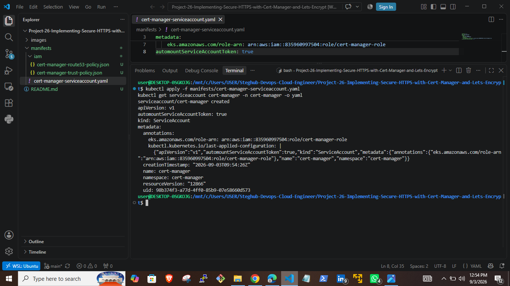

I created the policy and role, then attached one to the other, and created a Kubernetes service account annotated with the role ARN.

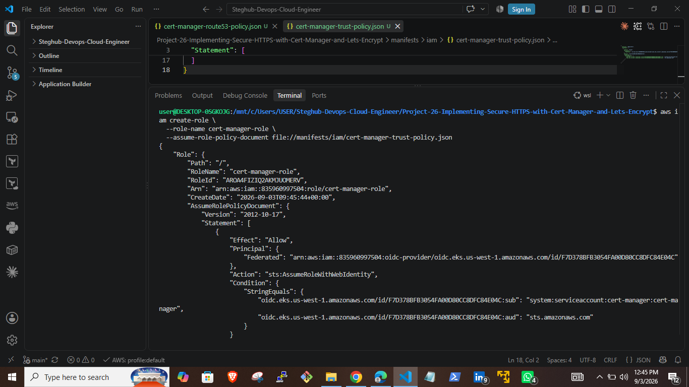

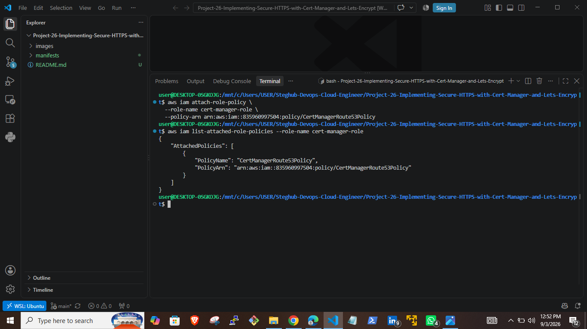

### Installing cert-manager

I installed cert-manager with Helm, pointing it at the service account I already created rather than letting the chart create its own, and setting the fsGroup so the pod can read the projected service account token:

```bash
helm install cert-manager jetstack/cert-manager \
  --namespace cert-manager \
  --version v1.15.3 \
  --set crds.enabled=true \
  --set serviceAccount.create=false \
  --set serviceAccount.name=cert-manager \
  --set securityContext.fsGroup=1001
```

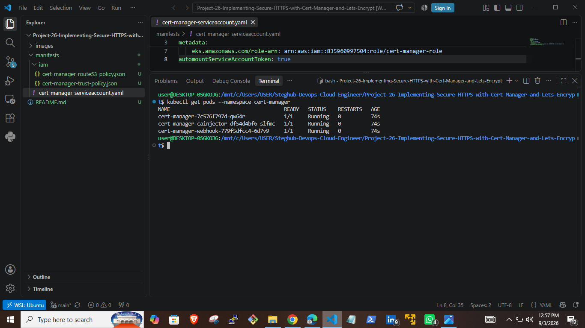

### Configuring the ClusterIssuer

The ClusterIssuer uses the DNS01 solver against Route 53, scoped to the one zone, and authenticates through the cert-manager service account rather than ambient credentials:

```yaml
apiVersion: cert-manager.io/v1
kind: ClusterIssuer
metadata:
  name: letsencrypt-prod
spec:
  acme:
    server: https://acme-v02.api.letsencrypt.org/directory
    email: lydiahngangatech@gmail.com
    privateKeySecretRef:
      name: letsencrypt-prod
    solvers:
      - selector:
          dnsZones:
            - "lydiahnganga.cloud"
        dns01:
          route53:
            region: us-east-1
            role: "arn:aws:iam::835960997504:role/cert-manager-role"
            auth:
              kubernetes:
                serviceAccountRef:
                  name: "cert-manager"
```

The region field here is the AWS region cert-manager uses to sign the Route 53 API calls, not the region the cluster runs in. Route 53 itself is a global service.

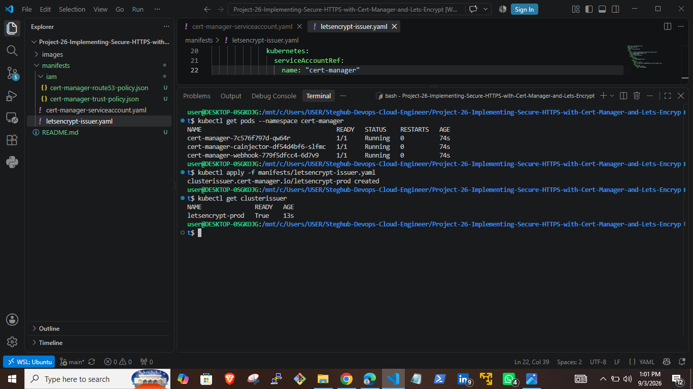

### Updating the Artifactory ingress

I added cert-manager annotations and a tls block to the ingress from Project 25, keeping the working backend service and port unchanged:

```yaml
apiVersion: networking.k8s.io/v1
kind: Ingress
metadata:
  name: artifactory-ingress
  namespace: tools
  annotations:
    nginx.ingress.kubernetes.io/proxy-body-size: 500m
    service.beta.kubernetes.io/aws-load-balancer-scheme: internet-facing
    service.beta.kubernetes.io/aws-load-balancer-type: nlb
    service.beta.kubernetes.io/aws-load-balancer-backend-protocol: tcp
    cert-manager.io/cluster-issuer: letsencrypt-prod
    cert-manager.io/private-key-rotation-policy: Always
  labels:
    name: artifactory
spec:
  ingressClassName: nginx
  tls:
    - hosts:
        - tooling.artifactory.lydiahnganga.cloud
      secretName: tooling.artifactory.lydiahnganga.cloud
  rules:
    - host: tooling.artifactory.lydiahnganga.cloud
      http:
        paths:
          - path: /
            pathType: Prefix
            backend:
              service:
                name: artifactory-artifactory-nginx
                port:
                  number: 80
```

Applying this ingress triggers cert-manager's ingress shim to create a Certificate resource automatically, without needing to write one by hand.

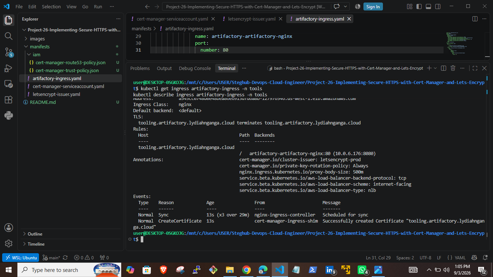

### Verifying certificate issuance

```bash
kubectl get certificate -n tools
curl -Ik --max-time 30 "https://tooling.artifactory.lydiahnganga.cloud"
echo | openssl s_client -connect tooling.artifactory.lydiahnganga.cloud:443 \
  -servername tooling.artifactory.lydiahnganga.cloud 2>/dev/null | openssl x509 -noout -issuer -subject -dates
```

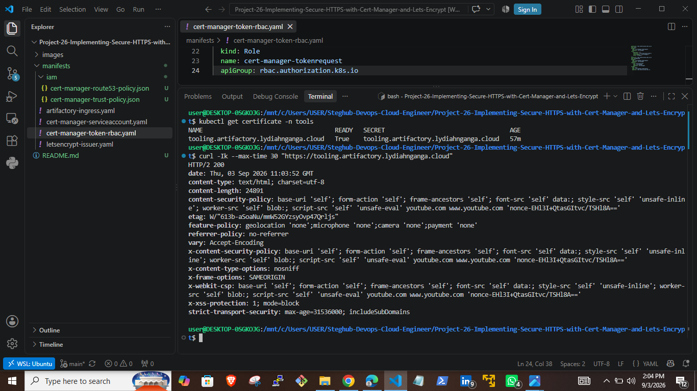

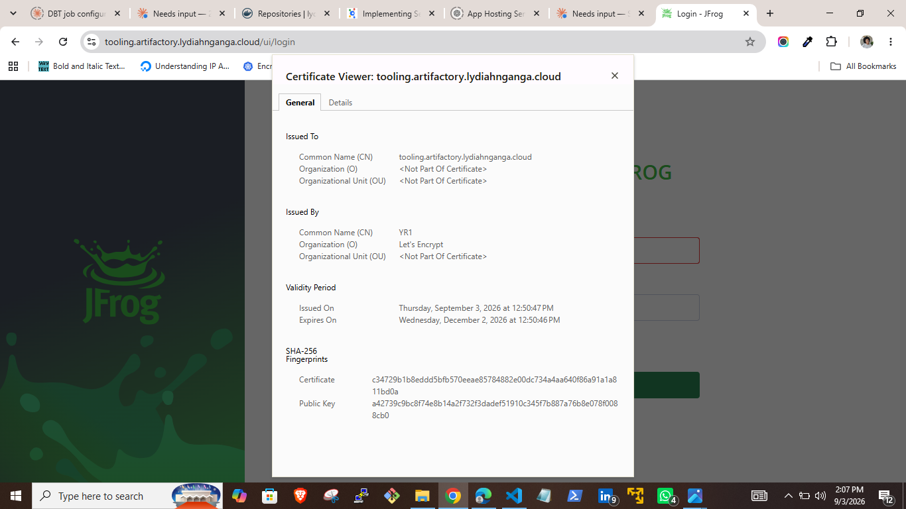

## Problems encountered and how I fixed them

The certificate stayed in a pending state for close to 30 minutes

The Certificate, CertificateRequest, and Order all looked healthy, but the Challenge stayed pending. Describing the Challenge showed the real cause:

```
error getting service account token: failed to request token for cert-manager/cert-manager:
serviceaccounts "cert-manager" is forbidden: User "system:serviceaccount:cert-manager:cert-manager"
cannot create resource "serviceaccounts/token" in API group ""
```

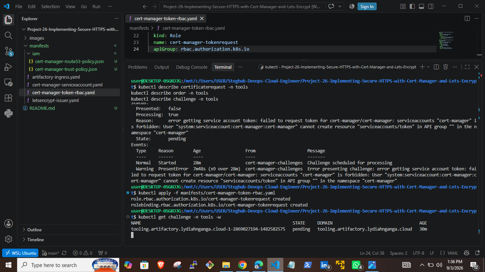

The ClusterIssuer's serviceAccountRef pattern makes cert-manager request a fresh token for its own service account through the Kubernetes TokenRequest API, which is a different permission from simply having a service account. Nothing had granted that permission yet. I added a narrowly scoped role and role binding:

```yaml
apiVersion: rbac.authorization.k8s.io/v1
kind: Role
metadata:
  name: cert-manager-tokenrequest
  namespace: cert-manager
rules:
  - apiGroups: [""]
    resources: ["serviceaccounts/token"]
    resourceNames: ["cert-manager"]
    verbs: ["create"]
---
apiVersion: rbac.authorization.k8s.io/v1
kind: RoleBinding
metadata:
  name: cert-manager-tokenrequest
  namespace: cert-manager
subjects:
  - kind: ServiceAccount
    name: cert-manager
    namespace: cert-manager
roleRef:
  kind: Role
  name: cert-manager-tokenrequest
  apiGroup: rbac.authorization.k8s.io
```

Within seconds of applying this, the Challenge moved from pending to valid, and the Certificate became ready.

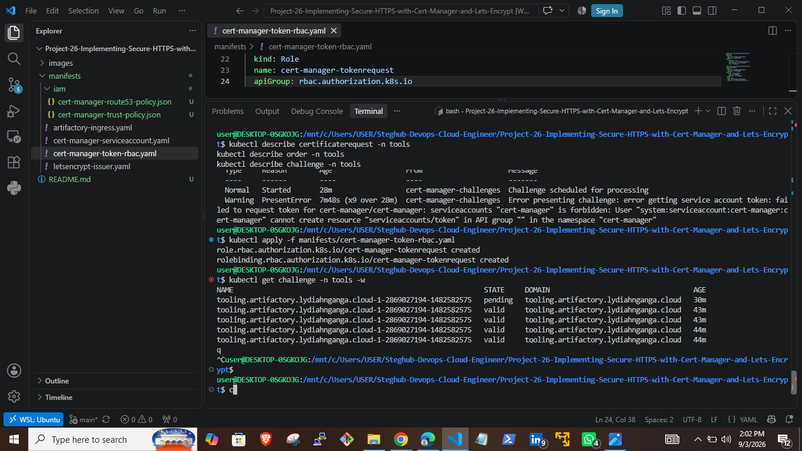

Terraform's Helm release update failed with an ownership error

When I brought the manually installed cert-manager release under Terraform, the apply failed:

```
Unable to continue with update: ServiceAccount "cert-manager" in namespace "cert-manager" exists
and cannot be imported into the current release: invalid ownership metadata
```

The Terraform configuration set serviceAccount.create to true, which tells Helm to take ownership of that service account as part of the release. Since the service account was created with plain kubectl apply, it had none of Helm's tracking labels or annotations, so Helm refused to touch it rather than silently overwrite something it did not recognize as its own. I added the three markers Helm expects directly:

```bash
kubectl label serviceaccount cert-manager -n cert-manager \
  app.kubernetes.io/managed-by=Helm --overwrite

kubectl annotate serviceaccount cert-manager -n cert-manager \
  meta.helm.sh/release-name=cert-manager \
  meta.helm.sh/release-namespace=cert-manager --overwrite
```

After that, Helm recognized the service account as already belonging to the release, and the apply completed cleanly.

A destroy failed partway through with a stale credentials error

```
Error: letsencrypt-prod failed to create kubernetes rest client for delete of resource:
the server has asked for the client to provide credentials
```

The EKS auth token Terraform had read at the start of the run had expired by the time it reached this resource, since tokens are only valid for about fifteen minutes. Terraform had already destroyed the IAM policy and its attachment before hitting this error. Re running terraform destroy picked up a fresh token and completed the remaining resources without any further changes needed.

## Automating with Terraform

Everything above was built by hand first, so I understood every piece before automating it. The Terraform code lives in its own directory with its own state file, separate from Project 24, so a mistake here can never touch the EKS cluster itself.

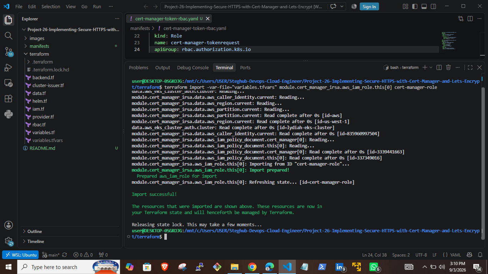

### Reading Project 24's state remotely

Rather than hardcoding the cluster endpoint, certificate authority data, or OIDC provider ARN, Project 26 reads them directly from Project 24's state:

```hcl
data "terraform_remote_state" "eks" {
  backend = "s3"
  config = {
    bucket = "lydiah-eks-terraform-state"
    key    = "eks/terraform.tfstate"
    region = "us-west-1"
  }
}
```

Project 24 did not originally expose these as outputs, so I added an outputs.tf there first, which was a zero resource change apply since outputs only surface values that already exist in state.

The kubernetes, helm, and kubectl providers are all configured from these remote values, so if Project 24 is ever rebuilt with a new OIDC provider ID, Project 26 just needs a re-apply rather than a manual ARN update.

### The IAM role, using a community IRSA module

Instead of hand writing the trust policy and permissions policy again, I used the same module family Project 24 already uses for the EBS CSI driver's IRSA role. It has a built in preset for exactly this use case:

```hcl
module "cert_manager_irsa" {
  source  = "terraform-aws-modules/iam/aws//modules/iam-role-for-service-accounts-eks"
  version = "~> 5.30"

  role_name = "cert-manager-role"

  attach_cert_manager_policy    = true
  cert_manager_hosted_zone_arns = [var.hosted_zone_arn]

  oidc_providers = {
    main = {
      provider_arn               = data.terraform_remote_state.eks.outputs.oidc_provider_arn
      namespace_service_accounts = ["cert-manager:cert-manager"]
    }
  }
}
```

### Installing cert-manager and RBAC through Terraform

The Helm release and the RBAC objects from the troubleshooting section above are both defined as Terraform resources, so the whole chain from role to running pods to token permissions is captured in one place:

```hcl
resource "helm_release" "cert_manager" {
  name       = "cert-manager"
  repository = "https://charts.jetstack.io"
  chart      = "cert-manager"
  version    = var.cert_manager_version
  namespace  = kubernetes_namespace.cert_manager.metadata[0].name

  set {
    name  = "serviceAccount.annotations.eks\\.amazonaws\\.com/role-arn"
    value = module.cert_manager_irsa.iam_role_arn
  }
}
```

### The ClusterIssuer, and why it needs a different provider

Terraform's own kubernetes_manifest resource needs to know a custom resource's schema at plan time, but the ClusterIssuer's CRD does not exist until the same apply installs cert-manager. Using kubernetes_manifest here creates a circular dependency that Terraform cannot resolve on a single apply.

I used the kubectl_manifest resource from the gavinbunney/kubectl provider instead, which applies server side without needing the schema known upfront:

```hcl
resource "kubectl_manifest" "letsencrypt_prod" {
  yaml_body = <<-YAML
    apiVersion: cert-manager.io/v1
    kind: ClusterIssuer
    ...
  YAML

  depends_on = [
    helm_release.cert_manager,
    kubernetes_role_binding.cert_manager_tokenrequest
  ]
}
```

### Importing the resources I already built by hand

Since everything already existed in the cluster and in AWS from the manual build, I imported each resource into Terraform's state rather than letting Terraform try to create duplicates:

```bash
terraform import module.cert_manager_irsa.aws_iam_role.this[0] cert-manager-role
terraform import kubernetes_namespace.cert_manager cert-manager
terraform import helm_release.cert_manager cert-manager/cert-manager
terraform import kubernetes_role.cert_manager_tokenrequest cert-manager/cert-manager-tokenrequest
terraform import kubernetes_role_binding.cert_manager_tokenrequest cert-manager/cert-manager-tokenrequest
terraform import kubectl_manifest.letsencrypt_prod "cert-manager.io/v1//ClusterIssuer//letsencrypt-prod"
```

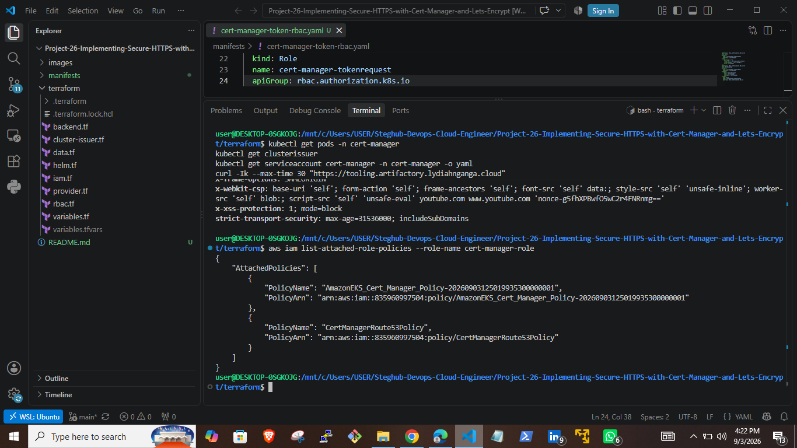

The one resource I did not import was the original manually created IAM policy. The Terraform module generates its policy with a random suffix in the name, so importing the differently named manual policy would have caused permanent drift on every future plan. I let Terraform create a new policy instead, then detached and deleted the old one once the new one was confirmed working.

```bash
aws iam detach-role-policy --role-name cert-manager-role \
  --policy-arn arn:aws:iam::835960997504:policy/CertManagerRoute53Policy

aws iam delete-policy \
  --policy-arn arn:aws:iam::835960997504:policy/CertManagerRoute53Policy
```

After all the imports and one Helm ServiceAccount ownership fix, terraform plan reported no differences between the configuration and the live infrastructure.

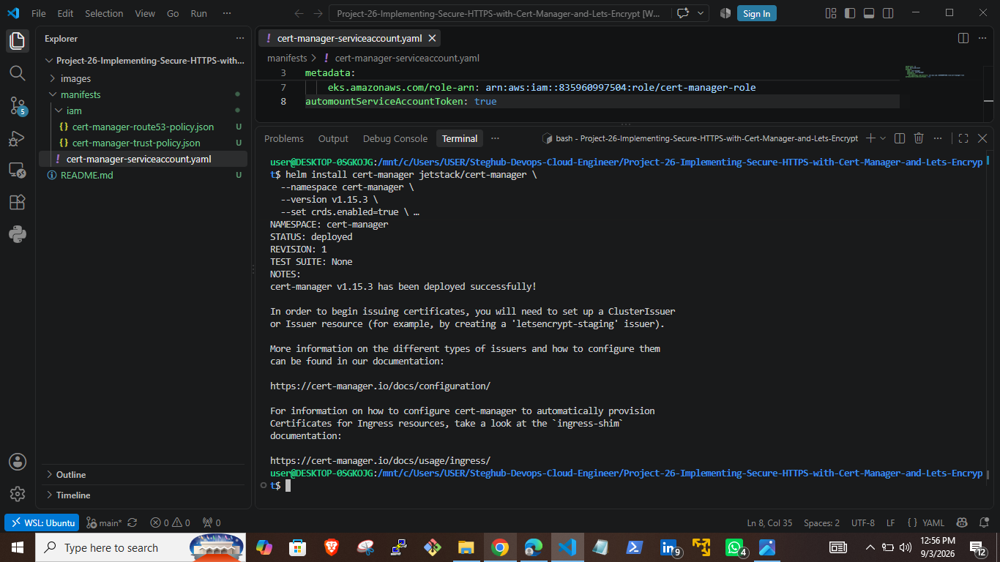

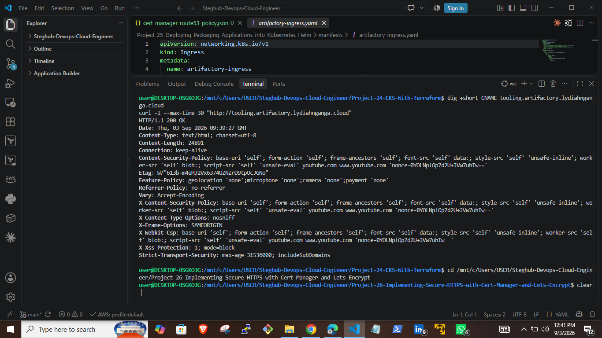

## Cleanup

Both Project 24 and Project 26 run on infrastructure that costs money while it exists, so I tear both down between working sessions.

```bash
cd Project-26-Implementing-Secure-HTTPS-with-Cert-Manager-and-Lets-Encrypt/terraform
terraform destroy -var-file="variables.tfvars"

helm uninstall artifactory -n tools
helm uninstall ingress-nginx -n ingress-nginx
kubectl delete namespace tools
kubectl delete namespace ingress-nginx

cd ../../Project-24-EKS-With-Terraform
terraform destroy -var-file="variables.tfvars"
```

Load balancers and PVCs need to come down before the VPC, since Kubernetes created resources like load balancers are not tracked by Project 24's Terraform state and will block the VPC from being deleted if they are still attached.

## What I learned

Terraform's kubernetes_manifest resource cannot always handle custom resources cleanly when the CRD and the manifest are created in the same apply. The kubectl_manifest resource from the community kubectl provider solves this by applying server side instead of relying on a schema Terraform can inspect at plan time.

Helm tracks ownership of every resource it manages through labels and annotations. A resource created outside Helm needs those markers added by hand before Helm will adopt it into a release, even if the resource itself is otherwise identical to what Helm would have created.

IRSA's trust policy conditions are strict about matching the exact service account name and namespace. When a ClusterIssuer authenticates through a serviceAccountRef rather than ambient pod credentials, that service account also needs explicit RBAC permission to request its own token, which is easy to miss since the ClusterIssuer itself will still report ready without it.

Terraform import is only worth doing when the resource's identifying attributes will actually match what the configuration generates. Importing a resource with a mismatched name into a module that generates that name dynamically creates permanent drift rather than fixing it.